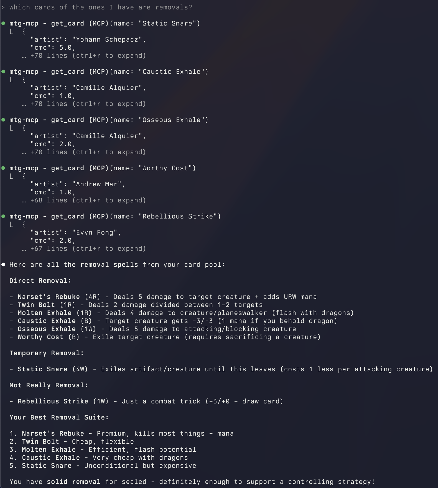
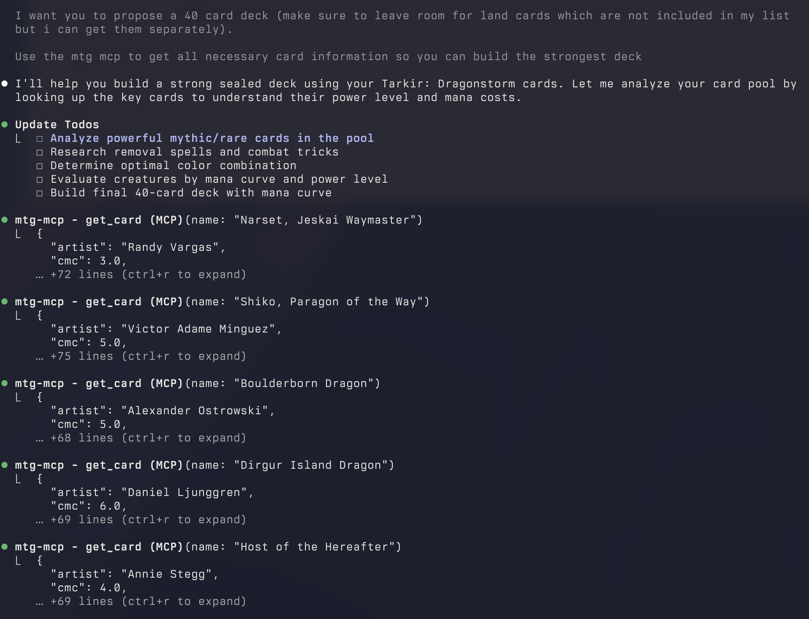

# MTG MCP


A Model Context Protocol server for Magic: The Gathering card data using the Scryfall API.

## What it does

This MCP server lets LLMs look up MTG cards and search through them. Pretty straightforward - you ask about a card, it fetches the data from Scryfall.

## Why use this?

If you're using Claude or another LLM that supports MCP, this gives it access to the entire MTG card database. This means you can:

- Get help building decks for any format (Standard, Modern, Commander, etc.)
- Analyze and tune your existing decks - find better cards, fix your mana curve
- Calculate the right number of lands for your deck based on your curve
- Look up card interactions and rules text while deck building
- Search for cards that fit specific strategies or combos
- Get deck recommendations based on cards you already own

Basically, it turns your LLM into a deck building assistant that actually knows what cards do.

## Screenshots

Here's the MCP server in action - looking up specific cards and getting detailed information:



And here's an example of using it for deck building, analyzing card synergies and getting suggestions:



## Installation

```bash
cargo install mtg-mcp
```

## Usage

The server exposes these tools:

- `get_card` - Look up a specific card by name (fuzzy search works)
- `search_cards` - Search for cards using Scryfall syntax

### Examples

Get a card:
```
get_card("Lightning Bolt")
```

Search for cards:
```
search_cards("color:red type:creature cmc:3")
```

## Setup with Claude

The easiest way to add this to Claude Desktop:

```bash
claude mcp add mtg-mcp
```

## Manual Configuration

If you prefer to configure manually, add this to your MCP settings:

```json
{
  "mcpServers": {
    "mtg": {
      "command": "mtg-mcp"
    }
  }
}
```

## Development

Standard Rust project. Uses tokio for async and reqwest for HTTP requests.

```bash
cargo test
cargo run
```

## License

MIT
